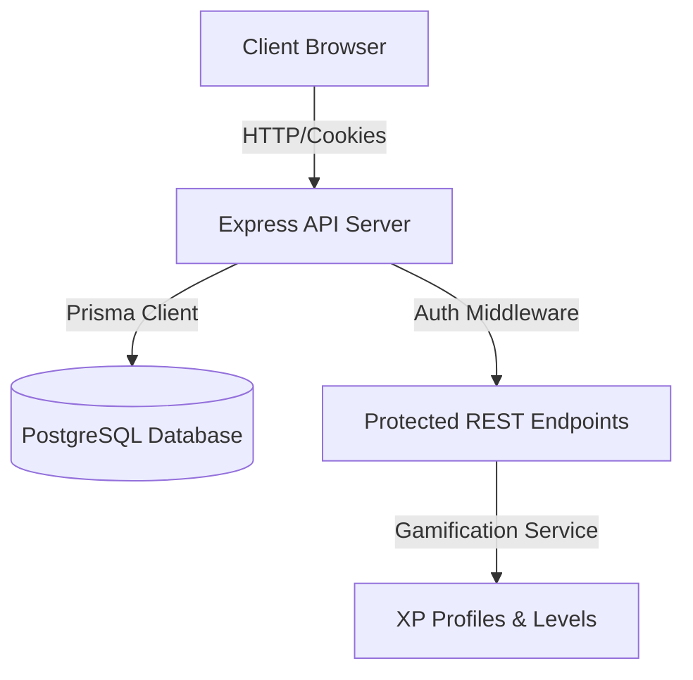

# DSA Master 🚀

DSA Master is a premium, high-fidelity online learning and coding platform designed to help users master **Data Structures & Algorithms in Java**. It features an interactive roadmap, learning modules, an integrated code compiler (Monaco Editor), a dynamic spaced-repetition revision planner, a gamified XP/level HUD, interactive algorithm visualization canvases, and detailed study analytics.

---

## 🛠️ Technology Stack

| Layer | Technology | Key Features |
| :--- | :--- | :--- |
| **Frontend** | React, Vite, TypeScript | SPA Routing, React Query, Recharts, TailwindCSS / HSL Sleek CSS |
| **Monaco Editor**| Microsoft Monaco Engine | Java syntax highlighting, code compilation submissions |
| **Backend** | Node.js, Express, TypeScript | REST APIs, JWT Auth Cookies, Custom Rate Limiters |
| **Database** | PostgreSQL, Prisma ORM | Relational models, cascaded deletes, index queries optimization |
| **Styling** | HSL CSS, Glassmorphism | Smooth micro-animations, theme toggles |

---

## 📂 Project Architecture



### Folder Structure
* `frontend/`: React SPA built with Vite
  - `src/components/`: Reusable components (buttons, cards, layout sidebars)
  - `src/pages/`: Dynamic pages (Analytics, Visualizer, Dashboard, Topic Detail, Practice Problems)
  - `src/services/`: REST client connectors (`api.ts` wrapper)
  - `src/store/`: Global auth states (`authStore.ts`)
* `backend/`: Express Server built with TypeScript
  - `prisma/`: Prisma database schema and seed script
  - `src/controllers/`: Route handlers (Auth, Analytics, Goals, Revisions, Notes)
  - `src/middleware/`: Security filters, auth validation, and rate limiters
  - `src/services/`: Core logic (Gamification XP milestones evaluator)

---

## 🔒 Environment Variables Configuration

Create a `.env` file inside your `backend/` directory utilizing your local development variables. When deploying to the cloud, configure these environment keys directly inside your hosting provider's dashboard consoles (e.g. Render and Vercel) instead of putting them in files pushed to version control.

---

## 🚀 Installation & Local Development

### 1. Database Setup
Start the local PostgreSQL container (if Docker is used):
```bash
docker run --name dsamaster-postgres -e POSTGRES_PASSWORD=postgres -e POSTGRES_DB=dsamaster -p 5432:5432 -d postgres
```

Inside `backend/` directory, apply the Prisma schema migration:
```bash
npx prisma db push
```

Populate the database with initial study roadmap lessons and achievements:
```bash
npx prisma db seed
```

### 2. Start Servers
* **Backend Dev Server**:
  ```bash
  cd backend
  npm install
  npm run dev
  ```
* **Frontend Dev Server**:
  ```bash
  cd frontend
  npm install
  npm run dev
  ```

---

## 🌐 Production Deployment Preparation

### Frontend (Vercel / Netlify)
1. Add environment variable `VITE_API_URL` pointing to your deployed backend URL.
2. Build command: `npm run build`
3. Output directory: `dist`

### Backend (Render / Railway / Heroku)
1. Configure env vars: `DATABASE_URL`, `JWT_SECRET`, `FRONTEND_URL`, `PORT`.
2. Build command: `npm run build`
3. Start command: `npm start`

### Database (Neon PostgreSQL)
1. Provision a serverless PostgreSQL cluster on [Neon](https://neon.tech/).
2. Copy connection string to `DATABASE_URL` env variable.
3. Run `npx prisma db push` to initialize tables.
